

  

  
  
  
  

# OpenTS on a controller

This fork of [OpenTS](https://github.com/OpenTS-Developers/OpenTS) adds a
controller scheme to the engine, built for and played on a Steam Deck and
tested on a 49-inch ultrawide monitor and a 4K television as well. It
follows *Command & Conquer: Red Alert Retaliation* on the PlayStation: the
menus are console screens, the sidebar is a grid of build sections, and
every order on the map is a button or a chord. The keyboard and mouse scheme
is the engine as upstream ships it. Every change is gated on the controller
scheme, so a keyboard player sees no difference.

## What it does

- **Console screens.** The main menu, campaign select, skirmish and LAN
  lobbies, options, audio, the pause menu, save and load, and an on-screen
  keyboard for names, all driven from the pad with the accept and back
  buttons shown as glyphs for an Xbox, PlayStation or Deck pad.
- **A pointer that plays well.** The left stick and d-pad move it at paces
  measured on the map, so a push covers the same ground at every zoom. It
  snaps onto units, the right shoulder speeds it, and what it cannot travel
  at the edge scrolls the map.
- **Cross and circle as the mouse buttons**, so selecting, ordering,
  deploying, placing and band boxing follow the game's own paths. A second
  tap of cross selects a unit's type on screen, a third the type on the map.
  Teams live on the face buttons with L1 and L2, and their units wear the
  button's glyph.
- **A fixed sidebar.** Five rows of two cells, your side and the other side,
  each cell a build section that opens into its grid. It slides over the map
  on triangle and can be pinned, and the map runs full width when it is out.
- **Zoom in place of resolution.** R1 and the right stick step the map's
  render height up and down a ladder cut to the panel's shape.
- **Retaliation's cheat codes**, keyed in on the sidebar's mode buttons in
  solo games.

[Controller scheme](docs/CONTROLS.md) lists every screen, button and chord,
with the layout diagram. [Controller support](docs/CONTROLLER.md) records how
each part is built, what was found on the way and what is next.

## Playing it

You need your own copy of *Tiberian Sun*, as with upstream OpenTS. Build the
engine as [Building OpenTS](docs/BUILDING.md) describes, then put `Game.exe`
and `Language.dll` in the game's folder in place of the originals. On a Steam
Deck the game runs under Proton from the Steam library as it does upstream;
the scheme switches to the controller when a pad is connected and back to
the keyboard when none is, and the Options screen sets it by hand. Holding
the menu and back buttons together for a second brings the controller
scheme up from any screen.

## Status

The GDI campaign is being played through on the fork, and the scheme is
adjusted as the missions turn things up. LAN lobbies exist but have not been
played between two machines. The fork tracks upstream `main`; engine fixes
found along the way go back upstream as pull requests, and the controller
scheme itself stays here for now.

## Screenshots

  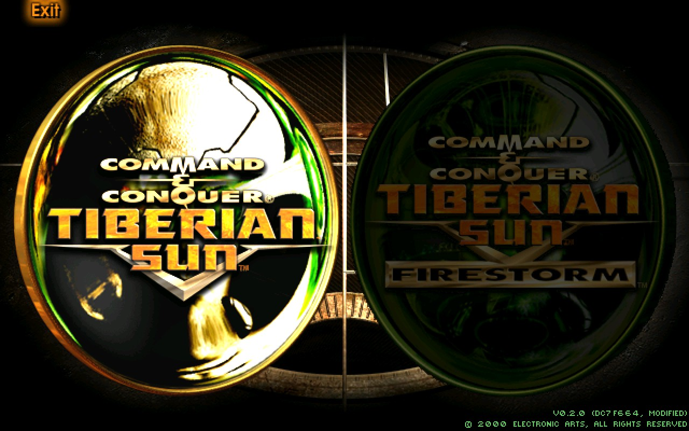
  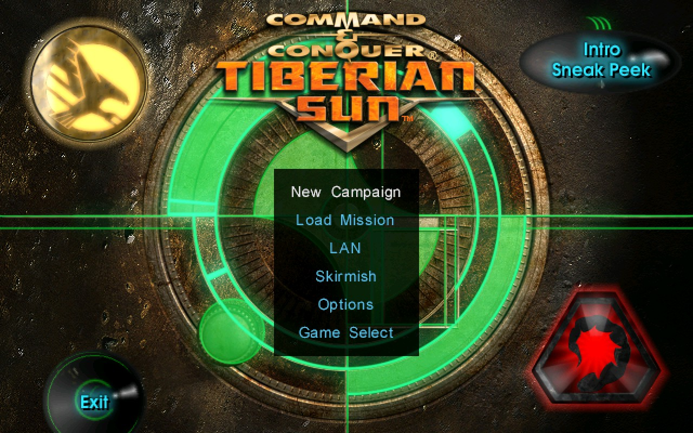
  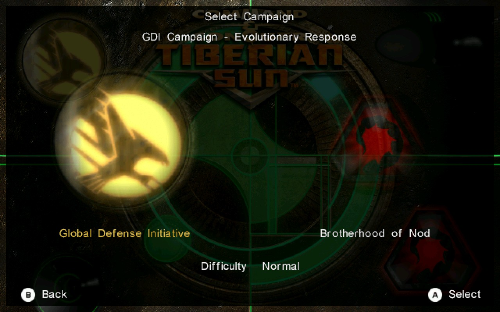
  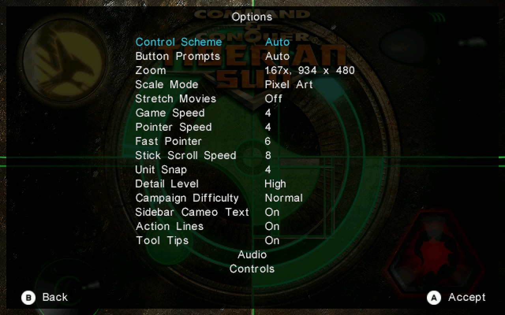
  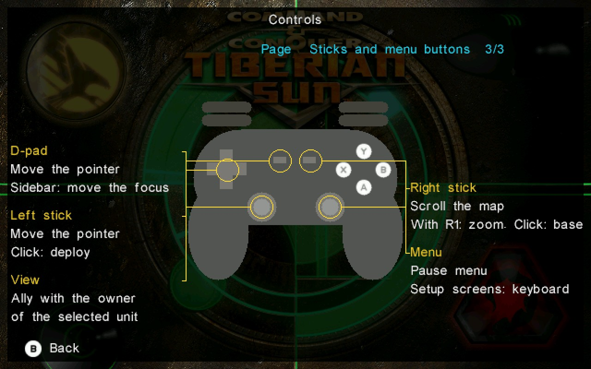
  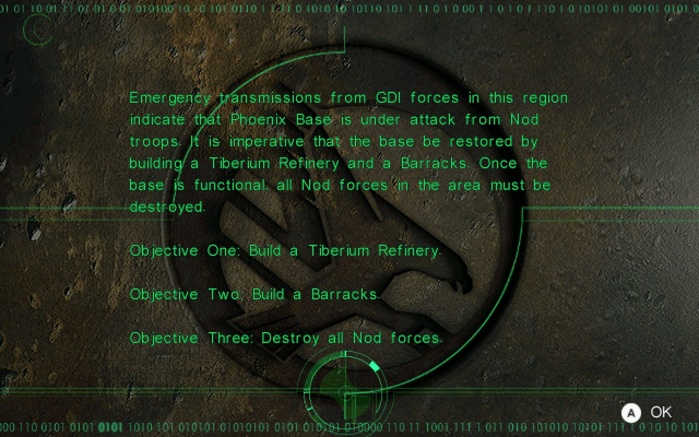
  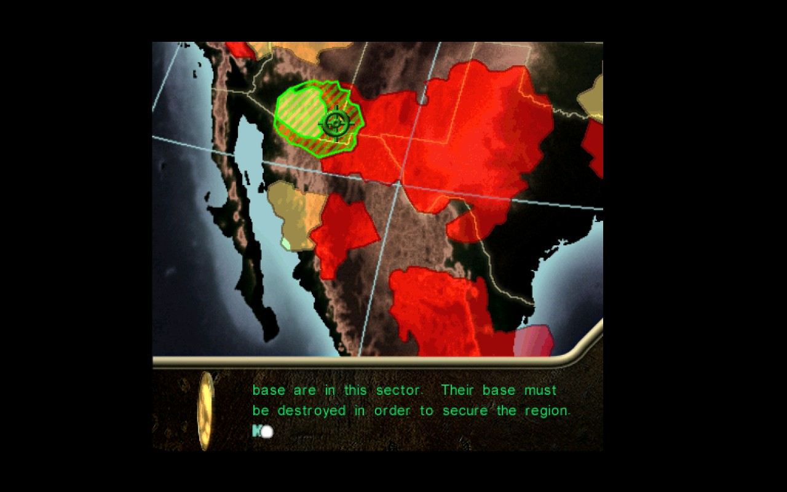
  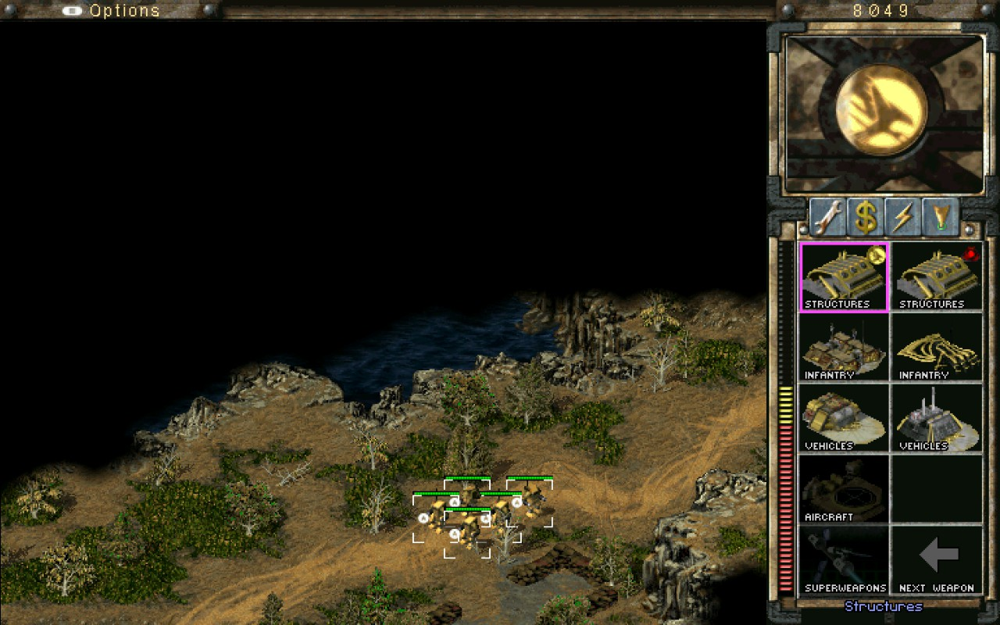
  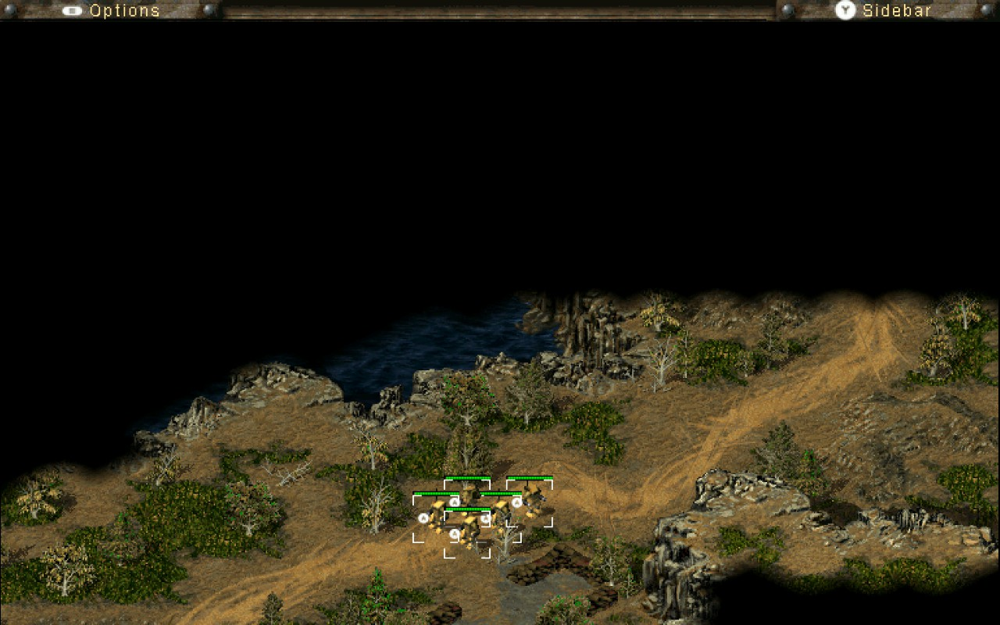
  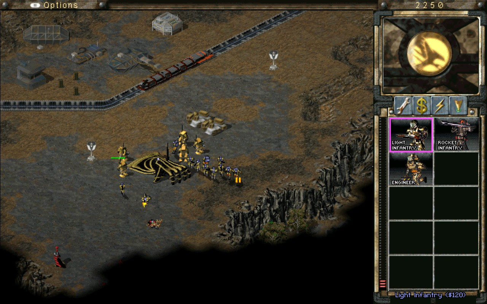
  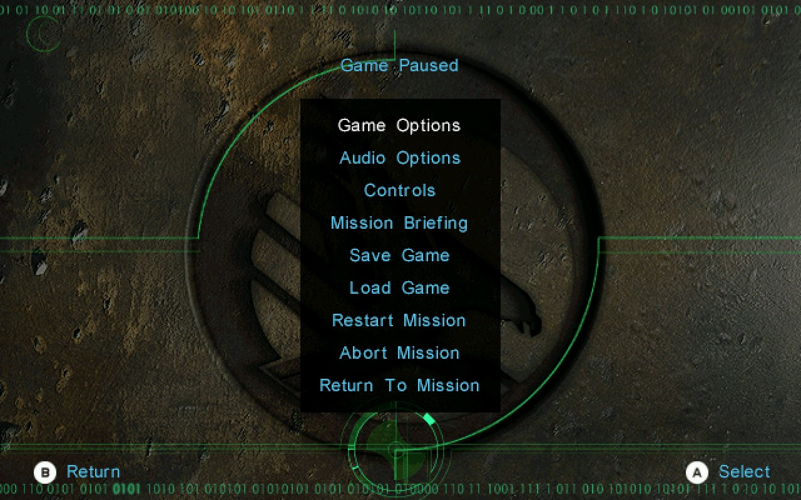
  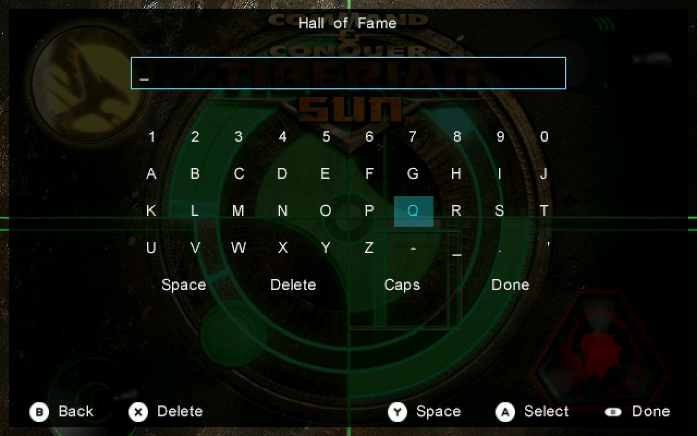

The rest of this page is upstream's.

# OpenTS

OpenTS is a community-led, open-source reconstruction of *Command & Conquer:
Tiberian Sun*. Instead of patching or extending the retail executable, it
rebuilds the engine as a standalone program.

OpenTS gives equal weight to two goals: maintaining a playable engine and
providing a capable platform for modding and engine development. Work on one
goal should not come at the expense of the other.

OpenTS is:

- an independent, community-led source reconstruction targeting Tiberian Sun
  2.03 Firestorm;
- a playable engine based on Electronic Arts' GPL-released source for related
  Command & Conquer games and Tiberian Sun-specific reverse engineering; and
- the active base for maintenance, documentation, modernization, bug fixes,
  and new modding capabilities.

OpenTS is not:

- a remaster or remake;
- an official Electronic Arts source release; or
- a distribution of the original game assets.

OpenTS is an independent community project and is not affiliated with or
endorsed by Electronic Arts.

## Community

- Discord: <https://opents.net/discord>
- Bug reports and proposals:
  [GitHub issues](https://github.com/OpenTS-Developers/OpenTS/issues)

## Downloads

- **Releases** are the recommended builds. Each zip on the
  [releases page](https://github.com/OpenTS-Developers/OpenTS/releases)
  contains `Game.exe`, `Language.dll`, and `Game.pdb`.
- **Nightly builds** are development snapshots from the
  [Engine nightly](https://github.com/OpenTS-Developers/OpenTS/actions/workflows/engine-nightly.yml)
  workflow. Download the latest one without a GitHub account through
  [nightly.link](https://nightly.link/OpenTS-Developers/OpenTS/workflows/engine-nightly/main).
  Nightlies contain the latest merged changes without release validation and
  expire after 90 days.

## Installing

1. Install Tiberian Sun from Command & Conquer The Ultimate Collection on
   Steam or the EA App.
2. Extract the release zip into the Tiberian Sun game directory.
3. Run `Game.exe`.

OpenTS supplies the engine, not the game data: the installation above
provides the original assets. There is no installer, and no extra runtime
library or launch argument is required. Windows is supported; Wine may work,
but there is no supported native Linux build. The engine asks Windows for the
UTF-8 code page, which needs Windows 10 version 1903 or newer. Older Windows
keeps its own code page, so game text still shows, but a path or file name
holding a character that code page lacks may fail.

## Documentation

The [OpenTS manual](https://opents-developers.github.io/OpenTS/) documents
setup, runtime behavior, INI configuration, mapping, and source-level
internals.

## State and plans

Release 0.1.0 runs the full Tiberian Sun 2.03 Firestorm game. The GDI, Nod,
and Firestorm campaigns, skirmish, and save/load have received full
play-through testing. LAN multiplayer has had more limited testing. No
user-visible regression from the original game is currently known. The
renderer uses
[bgfx](https://github.com/bkaradzic/bgfx) and supports modern resolutions
through 4K, including ultrawide.

The first of the project's three development milestones is the current focus:

1. CnCNet and CnCNet client support, including porting the parts of
   [ts-patches](https://github.com/CnCNet/ts-patches) this requires.
2. Feature parity with
   [Vinifera](https://github.com/Vinifera-Developers/Vinifera) and the rest
   of ts-patches.
3. Extending Tiberian Sun with new features, striving toward feature parity
   with Red Alert 2 and Yuri's Revenge, and growing engine capabilities that
   match or exceed the popular Yuri's Revenge engine extensions.

Alongside these goals, the engine is modernized incrementally toward an
entity-component architecture, and new development is shaped so that
migration stays possible. [Project direction](docs/DIRECTION.md) explains the
reasoning.

## Building

OpenTS builds as a 32-bit Windows target with Visual Studio 2022 and CMake.
[Building OpenTS](docs/BUILDING.md) documents the exact requirements,
commands, and outputs.

## Contributing

Bug reports, proposals, documentation improvements, and focused pull requests
are welcome. Review capacity is limited, so discuss non-trivial work with the
maintainers before implementing it. [CONTRIBUTING.md](CONTRIBUTING.md)
explains the current priorities and review policy; source conventions are in
[Style](docs/STYLE.md).

## Origins

OpenTS continues the community reconstruction preserved in the
[TibSun archive](https://github.com/OpenTS-Developers/TibSun), built from
Electronic Arts' published source for related Command & Conquer games and
completed through reverse engineering against the original executable.
[History](docs/HISTORY.md) records the reconstruction's lineage and methods.

## License and acknowledgements

OpenTS is licensed under the GNU General Public License, version 3 or later.
Material derived from Electronic Arts source remains subject to the additional
GPL Section 7 terms in [LICENSE.md](LICENSE.md).
[Third-party notices](THIRD_PARTY_NOTICES.md) identify bundled dependencies
and their licenses.

[ACKNOWLEDGEMENTS.md](ACKNOWLEDGEMENTS.md) thanks the people, projects, and
communities whose work made OpenTS possible.
