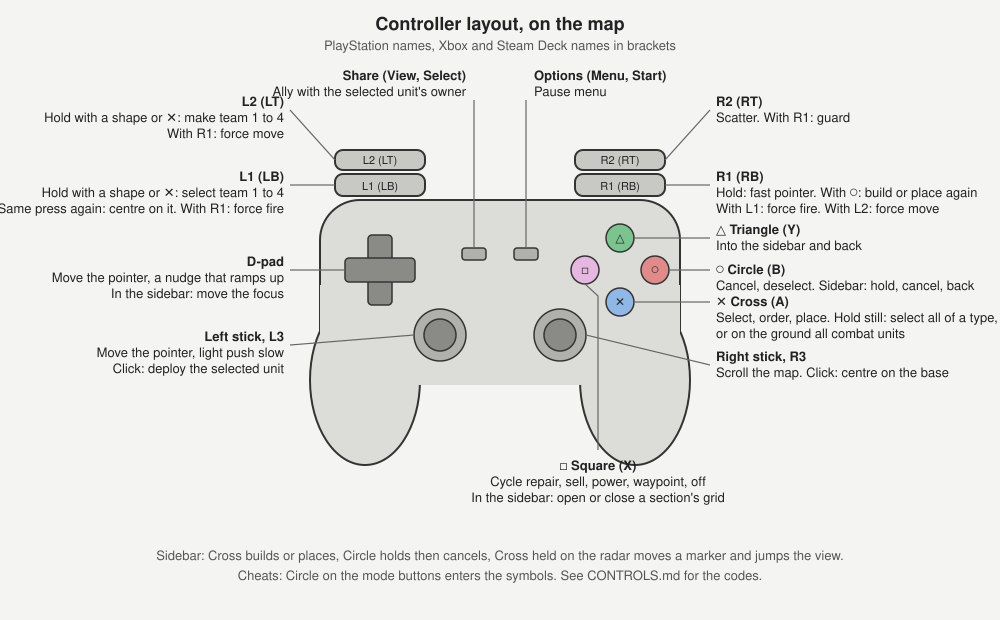

# Controller scheme

This is the player's reference for the controller scheme: every button in
the menus, on the map, in the sidebar, and the cheat codes. The scheme
follows Red Alert Retaliation on the PlayStation, so the buttons are named
in PlayStation terms with the Xbox and Steam Deck names beside them.
[CONTROLLER.md](CONTROLLER.md) records how each piece is built.

## Button names

| PlayStation | Xbox, Steam Deck |
| --- | --- |
| Cross | A |
| Circle | B |
| Square | X |
| Triangle | Y |
| L1, R1 | LB, RB |
| L2, R2 | LT, RT |
| L3, R3 | Left stick click, right stick click |
| Options | Menu, Start |
| Share | View, Select |

The button prompts on screen use the set the `PromptStyle` option picks:
Auto, Text, Xbox, PlayStation, or Steam Deck. Auto chooses Steam Deck on a
Deck, PlayStation when a Sony pad is connected, and Xbox otherwise.

## Choosing the scheme

`ControlScheme` in `SUN.INI` is `Auto` by default: the controller scheme
when a pad is connected by the time the first menu shows, otherwise
keyboard and mouse until a pad button is pressed on a menu. The Options
screen's Control Scheme row offers Auto, Keyboard & Mouse, and Controller. Holding Options and
Circle together for a second switches to the controller scheme from
anywhere, so a pad-only player is never locked out. The mouse and keyboard
keep working under the controller scheme.

## Menus and screens

| Action | Button |
| --- | --- |
| Move between rows | D-pad or left stick |
| Change a value | Left or Right |
| Change a value by five | L1 or R1 with Left or Right |
| Accept, open, select | Cross |
| Back | Circle |
| Start the game from a setup screen | Cross, on any row |
| Open the on-screen keyboard on a setup screen | Options |
| Open the pause menu in play | Options |

The skirmish and LAN host screens start the game on Cross from any row.
Options opens the on-screen keyboard from any row: the name on the skirmish
and LAN games screens, the chat in a lobby. The campaign select picks a
side with Left and Right and starts on Cross. The load list, the options,
audio, and controls screens, and the LAN lobbies are lists of the same
shape. The mission briefing continues or turns the page on Cross and plays
the mission video, when there is one, on Circle. The score screens continue
on Cross, and a hall of fame place takes its name on the keyboard.

Any of the original dialogs that still appear are driven the same way:
D-pad as the arrow keys, Cross as Enter, Circle as Escape.

## On-screen keyboard

| Action | Button |
| --- | --- |
| Move between keys | D-pad or left stick |
| Type the key | Cross |
| Delete | Square |
| Space | Triangle |
| Finish and keep the text | Options, or Cross on Done |
| Back out with the text unchanged | Circle |

Letters are capitals at the start of each word and lower case after; Caps
locks them on. A real keyboard types straight in, with Enter finishing and
Escape backing out.

## On the map

The pointer stays on the map; the sidebar is worked by the pad, below.

| Action | Button |
| --- | --- |
| Move the pointer | Left stick, or D-pad |
| Fast pointer | Hold R1 while moving |
| Scroll the map | Right stick, or push the pointer against the edge |
| Zoom in or out | Hold R1 and push the right stick up or down |
| Select, order, place, band box | Cross, as the left mouse button |
| Cancel a mode, deselect | Circle, as a right mouse tap |
| Deploy the selected unit | L3 |
| Centre the view on the base | R3 |
| Scatter, or in waypoint mode take back the last waypoint | R2 |
| Guard | R1 with R2 |
| Force fire at the pointer | R1 with L1 |
| Force move to the pointer | R1 with L2 |
| Ally with the selected unit's owner | Share |
| Pause menu | Options |

The left stick moves the pointer at a steady rate for how far it is pushed,
and the D-pad from half its pace to full within the first moment of a
press, so a tap stays within a cell and a hold travels at once. Both paces
are distances on the map, so a tap or a push covers the same ground at
every zoom and on every screen; a wide screen simply takes longer to cross.
When the stick or D-pad comes to rest with a unit or building near the
pointer, the pointer settles onto it, so a target is hit without
pixel-perfect aim; travel is never pulled. The Unit Snap row on the options
screen sets how near, in eighths of a cell: 4 is half a cell and the
default, 8 a whole cell, Off leaves the pointer where it stops. It is saved
as `PadSnap` in `SUN.INI`. What the pointer cannot travel past the edge scrolls the
map at the pointer's own pace, so R1 speeds both alike.

Cross held still for half a second on one of your units selects every unit
of its type on screen, and held on a little longer widens that to the whole
map. Held still on the ground it selects every combat unit on screen, then
every combat unit on the map. A combat unit is one that carries a weapon or
gains one by deploying, so tick tanks and artillery count while harvesters,
engineers, sensor arrays and the construction vehicle do not. Each of the
four says what it selected in the message list at the top left.

Force fire and force move go out the moment the two buttons are held
together, at the pointer, with no Cross. The engine only allows an alliance
against a human player in a game with allies on.

### Teams

| Action | Button |
| --- | --- |
| Make team 1, 2, 3 or 4 from the selection | L2 with Square, Triangle, Circle or Cross |
| Select team 1, 2, 3 or 4 | L1 with Square, Triangle, Circle or Cross |
| Centre the view on the team | The same L1 press again within 400 ms |

### Waypoints

Square cycles the sidebar's modes from the map: repair, sell, power,
waypoint, off, passing over any the game refuses, so with no buildings it
goes straight to waypoints. In waypoint mode Cross places waypoints and R2
takes back the last one while the path has one; Circle stays deselect.

### Zoom

The game draws at a render size and scales it to the screen, so zooming in
means drawing fewer pixels and showing them bigger. R1 with the right stick
up zooms in a step and down zooms out, one step per push and another every
quarter second the stick stays pushed. The steps are render heights of 480,
540, 600, 660, 720, 768, 840, 900, 1080, 1200 and 1440, never taller than
the screen, with the width on the screen's own shape so there are no bars.
Each step keeps the middle of the view where it was. The size is saved as `PadZoomWidth` and `PadZoomHeight`
in `SUN.INI`; the first game, or one on a screen of a different shape,
starts at 768 high, or 600 on a Steam Deck. The options screen's Zoom row
steps the same sizes. The right stick does not scroll while R1 is held.

### Pointer speed

The console options screen has Pointer Speed, Fast Pointer and Stick Scroll
Speed rows, 1 to 10, saved as `PadPointerSpeed`, `PadFastSpeed` and
`PadScrollSpeed` in `SUN.INI`. They govern the stick and D-pad, R1's boost,
and the right stick's scroll. The mouse's scroll rate leaves the pad alone.

## Sidebar

Under the controller scheme the sidebar is a fixed grid in the manner of
Retaliation: two columns, your side on the left and the other on the right,
with rows for structures, infantry, vehicles and aircraft, and a bottom row
holding the current superweapon and a cell that cycles to the next. The
four mode buttons and the radar sit above the grid. The bar across the top
of the map keeps its size with the sidebar whatever the zoom, Options
with the menu button's glyph at its left and the mission timer at its
right.

| Action | Button |
| --- | --- |
| Take the pad into the sidebar, and back to the map | Triangle |
| Move between cells, the mode buttons and the radar | D-pad or left stick |
| Build or place the section's current or last item; open a section that has none | Cross |
| In a grid, build the marked item | Cross |
| Hold, then cancel, what a section is building; open an idle section | Circle |
| In a grid, cancel the marked build, or step back to the sections | Circle |
| Open or close a section's grid without cancelling anything | Square |
| Work the parked cell from the map: place, build again, add one more, or queue the marked item | R1 with Circle |
| Pick a mode button: repair, sell, power, waypoint | Cross on the button |
| Fire the current superweapon | Cross on the superweapon cell |
| Cycle to the next superweapon | Cross on the cell beside it |
| Move a marker over the radar and jump the view there | Cross held on the radar, then released |

The outline is bright while the pad is inside and dim outside, and it parks
where it was left. Placing a building, aiming a superweapon or picking a
mode hands focus back to the map with the ghost, target or mode cursor on
the pointer. The structures grid closes after a build, since a construction
yard builds one thing at a time. Sections whose factory you do not hold are
dulled; with a construction yard all four of a side's sections show.

## Cheats

Retaliation's cheat codes are keyed in on the four mode buttons: inside the
sidebar, Circle on Repair, Sell, Power or Waypoint enters that button as a
symbol with a click, and the last six symbols are matched against the
codes. A match plays the options sound and says what it did in the message
list. Solo games only. The buttons stand in for Retaliation's glyph row in
its order: Repair for Cross, Sell for Circle, Power for Triangle, Waypoint
for Square.

| Cheat | Code |
| --- | --- |
| 5000 credits | Repair, Repair, Waypoint, Sell, Sell, Sell |
| Reveal the map with the radar on; again to put the shroud back | Power, Power, Repair, Sell, Power, Waypoint |
| Win the mission | Sell, Sell, Power, Repair, Repair, Waypoint |
| Ion cannon | Sell, Repair, Sell, Sell, Repair, Waypoint |
| Multi missile | Waypoint, Sell, Power, Repair, Sell, Sell |
| Chemical missile | Waypoint, Repair, Sell, Repair, Power, Power |
| Hunter seeker | Repair, Repair, Repair, Sell, Power, Waypoint |
| Drop pods | Waypoint, Waypoint, Sell, Sell, Power, Power |

Putting the shroud back keeps what your units have seen since the reveal.
The radar the cheat gives still needs power. A superweapon you hold is
charged; one you lack is granted for a single shot. A weapon the game's rules
do not define says so in the message list: the stock Tiberian Sun rules
declare the drop pods without their behaviour, so that code needs a
Firestorm game.

## Pause menu

Options in play opens the pause menu: Game Options, Audio Options,
Controls, Mission Briefing in a campaign, Save Game, Load Game, Restart
Mission, Abort Mission, and Return To Mission. Restart and Abort ask as a
row whose value flips between No and Yes. In a LAN game Save and Load take
the multiplayer paths and Restart becomes Surrender.

## Where Retaliation differs

- Retaliation moves the pointer with the D-pad alone; here the left stick
  moves it too and the right stick scrolls.
- Retaliation's Square toggles the cursor mode and its Triangle opens the
  sidebar; here Square cycles the modes and Triangle opens the sidebar, as
  on its Controls screen.
- Retaliation pins the sidebar on screen with R1 and Triangle. The sidebar
  in Tiberian Sun is always on screen, so there is no pin.
- Retaliation's team icons sit on the sidebar; here teams are the shoulder
  chords above.
